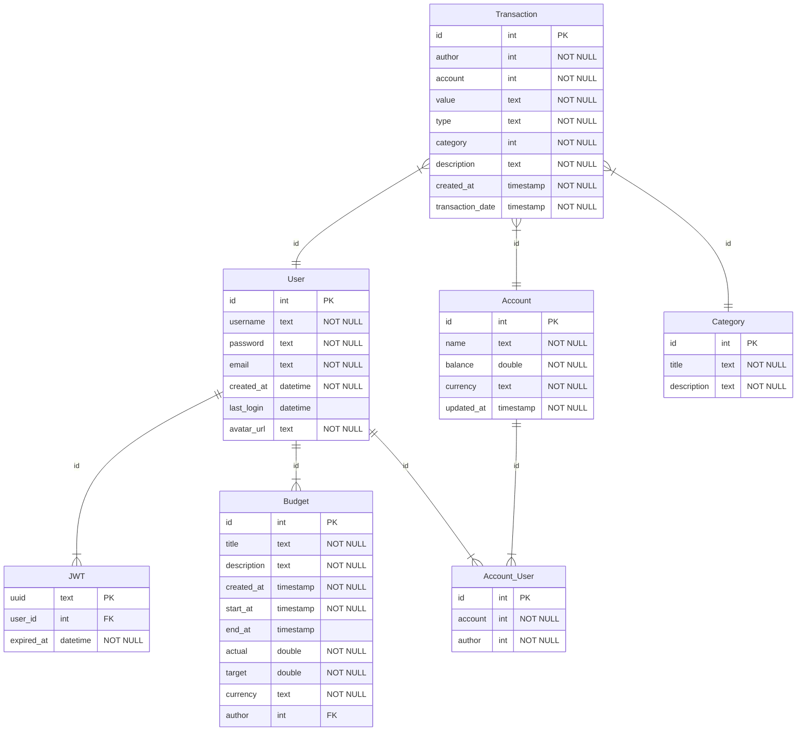

```mermaid
erDiagram    
    User {
        id int "PK"
        username text "NOT NULL"
        password text "NOT NULL"
        email text "NOT NULL"
        created_at datetime "NOT NULL"
        last_login datetime
        avatar_url text "NOT NULL"
    }
    
    JWT {
        uuid text "PK"
        user_id int "FK"
        expired_at datetime "NOT NULL"
    }
    
    Budget {
        id int "PK"
        title text "NOT NULL"
        description text "NOT NULL"
        created_at timestamp "NOT NULL"
        start_at timestamp "NOT NULL"
        end_at timestamp
        actual double "NOT NULL"
        target double "NOT NULL"
        currency text "NOT NULL"
        author int "FK"
    }
    
    Account {
        id int "PK"
        name text "NOT NULL"
        balance double "NOT NULL"
        currency text "NOT NULL"
        updated_at timestamp "NOT NULL"
    }
    
    Account_User {
        id int "PK"
        account int "NOT NULL"
        author int "NOT NULL"
    }
    
    Transaction {
        id int "PK"
        author int "NOT NULL"
        account int "NOT NULL"
        value text "NOT NULL"
        type text "NOT NULL"
        category int "NOT NULL"
        description text "NOT NULL"
        created_at timestamp "NOT NULL"
        transaction_date timestamp "NOT NULL" 
    }

    Category {
        id int "PK"
        title text "NOT NULL"
        description text "NOT NULL"
    }
    
    User ||--|{ JWT: id
    User ||--|{ Budget: id
    User ||--|{ Account_User: id
    Account ||--|{ Account_User: id
    Transaction }|--|| Category: id
    Transaction }|--|| User: id
    Transaction }|--|| Account: id
```

Или [ссылка](https://dbdiagram.io/d/GPTeam-690d0ed46735e11170a2094f) на dbdiagram.
